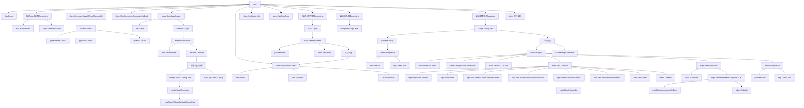

```mermaid
graph TD
    A[main] --> B[flag.Parse]
    A --> C[启动pprof服务器goroutine]
    C --> C1[mux.HandleFunc]
    C --> C2[http.ListenAndServe]
    
    A --> D[slave.GenerateSlaveIDFromMachineID]
    D --> E[GetMachineID]
    E --> F[getWindowsCPUID]
    E --> G[getLinuxCPUID]
    E --> H[getMacCPUID]
    
    A --> I[slave.SetConnectionCompleteCallback]
    
    A --> J[slave.StartSlaveServer]
    J --> J1[net.Listen]
    J --> J2[listener.Accept]
    J2 --> K[handleConnection]
    K --> K1[json.NewDecoder]
    K --> K2[decoder.Decode]
    K2 --> K3[消息类型判断]
    K3 --> K4[configChan <- configData]
    K3 --> K5[messageChan <- msg]
    K4 --> K6[handleStopCommand]
    K6 --> K7[stopSlaveWithoutStatusChangeFunc]
    
    A --> M[slave.RegisterToMaster]
    M --> N[GetLocalIP]
    M --> M1[json.Marshal]
    M --> M2[http.Client.Post]
    
    A --> O[slave.SetMasterInfo]
    A --> P[slave.SetStopFunc]
    
    A --> Q[启动心跳包发送goroutine]
    Q --> R[ticker.C循环]
    R --> R1[slave.SendHeartbeat]
    R1 --> R2[json.Marshal]
    R1 --> R3[http.Client.Post]
    R1 --> R4[错误检查]
    R4 --> M
    
    A --> S[启动消息处理goroutine]
    S --> S1[range messageChan]
    
    A --> T[启动配置处理goroutine]
    T --> T1[range configChan]
    T1 --> U[processConfig]
    T1 --> V[命令类型]
    V --> V1[connectMQTT]
    V --> V2[handleStopCommand]
    
    U --> U1[sendConfigResult]
    U1 --> U2[json.Marshal]
    U1 --> U3[http.Client.Post]
    
    V1 --> W[disconnectAllClients]
    V1 --> X[slave.SetExpectedConnections]
    V1 --> Y[slave.NewMQTTClient]
    V1 --> Z[mqttClient.Connect]
    Z --> Z1[mqtt.NewClientOptions]
    Z --> Z2[opts.AddBroker]
    Z --> Z3[opts.SetClientID/Username/Password]
    Z --> Z4[opts.SetCleanSession/AutoReconnect]
    Z --> Z5[opts.SetOnConnectHandler]
    Z5 --> Z6[mqttClient.Subscribe]
    Z --> Z7[opts.SetConnectionLostHandler]
    Z --> Z8[mqtt.NewClient]
    Z --> Z9[client.Connect]
    
    V1 --> AB[mqttClient.Subscribe]
    AB --> AC[client.Subscribe]
    AB --> AD[mqttClient.handleMessageWithACK]
    AD --> AE[mqttClient.constructACKData]
    AD --> AF[client.Publish]
    
    V1 --> AG[sendConfigResult]
    AG --> AG1[json.Marshal]
    AG --> AG2[http.Client.Post]
    
    A --> AH[select 保持运行]
```